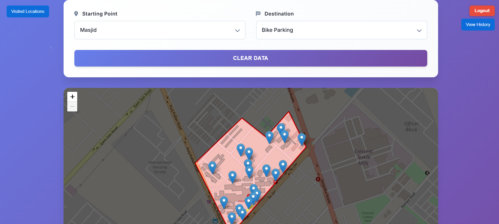
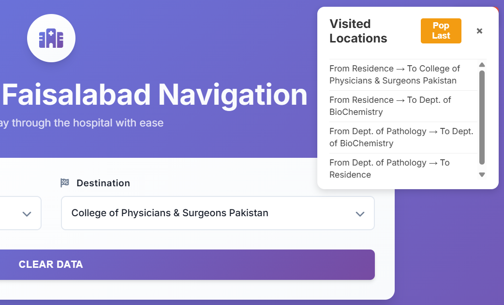
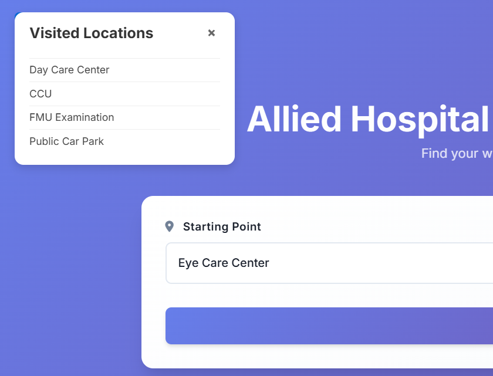
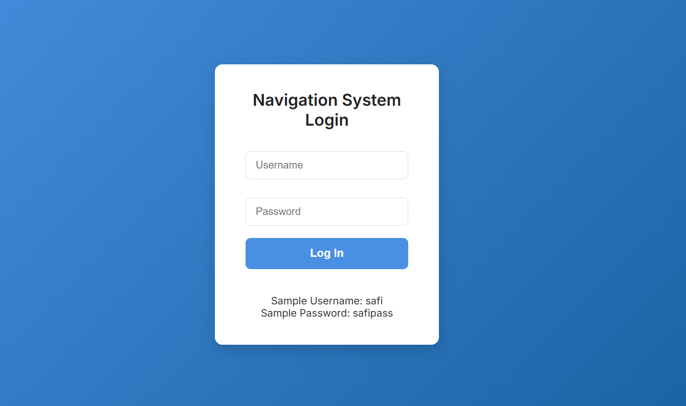

# 🏥 Navigation System - Data Structures Project

Welcome to the **Navigation System** — an educational project built for a **4th semester Data Structures course**. This system demonstrates how fundamental data structures can be applied to solve real-world problems in a web-based hospital navigation context.

---

## 🎯 Project Objective

This project simulates navigation within a hospital environment. Users can select starting and ending locations (e.g., OPD → Emergency), and the system calculates the **shortest route** using Dijkstra's algorithm.

Beyond route calculation, the project demonstrates how **Stacks**, **Sets**, and **Hash Maps** can be integrated into a functional web app — reinforcing how theoretical data structures power practical applications.

---

## 🧠 Data Structures Used

| 📦 Data Structure     | 💡 Purpose                                                                 |
|----------------------|-----------------------------------------------------------------------------|
| **Dijkstra’s Algorithm** | Finds the shortest path between nodes (locations) on the hospital map.      |
| **Stack**             | Maintains navigation history — allowing "back" functionality and review.    |
| **Set**               | Tracks unique visited nodes to prevent duplicates in the visited list.      |
| **Hash Map**          | Handles user authentication — stores and checks username-password pairs.    |

---

## 💻 Tech Stack

- **Frontend**: HTML, CSS, JavaScript
- **Mapping**: Leaflet.js
- **Pathfinding**: Turf.js for spatial analysis
- **Data Structures**: Custom-built Stack, Set, and Map logic in JavaScript modules

---

## 📌 Features

- 🌐 Selectable map interface for hospital layout
- 📍 Dijkstra-based route calculation
- 🧭 View history of visited paths using a **Stack**
- 📚 Keep track of visited unique locations using a **Set**
- 🔐 Login functionality using a **Hash Map**
- 🧾 Interactive modals to display project purpose and usage
- 🎨 Clean, responsive UI

---

## 🚪 How to Use

1. Launch the `Login` page and log in using the provided sample credentials:
   - **Username:** `safi`
   - **Password:** `safipass`

2. After login, the main interface allows you to:
   - Select starting and destination points
   - View the calculated shortest route
   - Track route history and visited locations

3. Overlays and buttons let you explore:
   - Visited locations (Set)
   - Navigation history (Stack)
   - Logout and reset options

---

## 🎓 Educational Purpose

This project is designed for academic demonstration of how **data structures** work in real-world apps. It emphasizes:

- Algorithm integration in UI
- State management using stack/set
- Authentication using hash maps
- Visual interactivity using graphs on maps

> ⚠️ **Note:** This project is for educational purposes only and is not meant for production deployment.

---

## 👨‍💻 Author

Made with ❤️ by **[Safi Khan](https://safikhan.me)**  
_Data Structures – 4th Semester Project_

---

## 📷 Screenshots

## Main Navigation Map

## Route History

## Visited Locations

## Login Page


---

## 📁 Project Structure

```bash
NAVIGATIONSYSTEM/
├── MapData/
│   ├── customPoints.js        # Predefined important locations (nodes)
│   ├── hospital.json          # Example or specific dataset
│   └── map.osm                # Raw OSM data file (to be converted to GeoJSON)
│
├── Pages/
│   ├── Login/
│   │   ├── login.html         # Login UI
│   │   ├── login.css          # Login styling
│   │   └── login.js           # Login logic and validation
│   │
│   └── Navigation/
│       ├── index.html         # Map interface with Leaflet
│       ├── style.css          # Styling for navigation UI
│       └── script.js          # Logic to display nodes, paths, and handle interactions
│
├── StructuresAlgorithms/
│   ├── Dijkstra.js            # Dijkstra’s algorithm for shortest path
│   ├── Set.js                 # Custom Set data structure
│   └── Stack.js               # Custom Stack (for path tracing, etc.)
│
├── Utils/
│   ├── authenticationData.js  # Fake/mock authentication backend
│   └── drawRoute.js           # Function to draw path between two nodes

